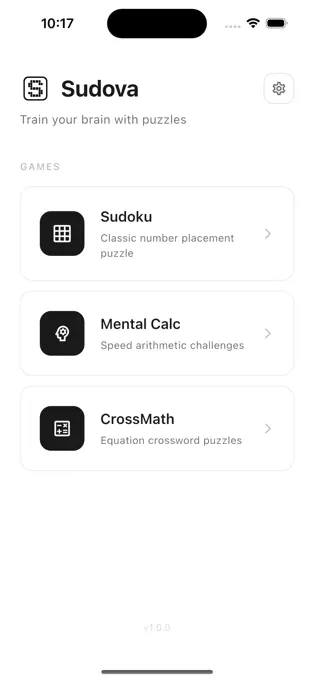
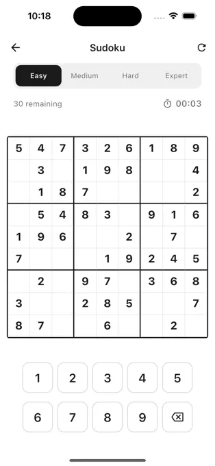
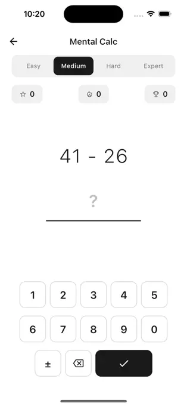
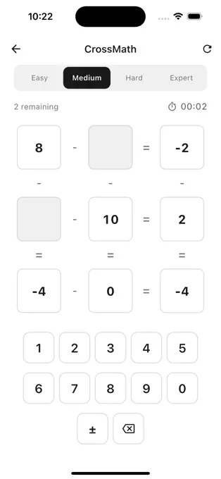

# Sudova

Train your brain with unique puzzle games.

[Download on the App Store](https://apps.apple.com/fr/app/sudova/id6760390974)

## Screenshots

  
  
  
  

## Games

- **Sudoku** — Classic number placement puzzles from Easy to Expert
- **Mental Calc** — Speed arithmetic challenges to sharpen your calculation skills
- **CrossMath** — Equation crossword puzzles combining logic and math
- **Magic Sort** — Reorder sequences against the clock
- **Maze** — Procedurally generated labyrinths, never the same twice

## Features

- Clean, minimalist design
- Four difficulty levels
- Built-in timer
- Haptic feedback
- No ads, no accounts, no data collection
- Fully offline

## Tech

Built with [Flutter](https://flutter.dev).

## License

[MIT](LICENSE)
